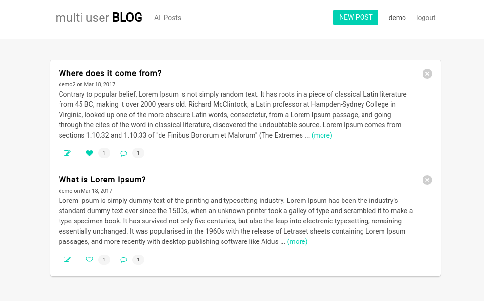

Udacity Multi User Blog
==

> A Multi User Blog that allows users to post content, like and comment on it.



The app can be accessed [here](https://multi-user-blog-161914.appspot.com)

You can create your own user or you can use this user:
```
User: demo
Pass: demo
```

## Prerequisites
To execute this project you will need these:
- [git](https://git-scm.com/downloads)
- [python2](https://www.python.org/downloads/)
- [gcloud](https://cloud.google.com/sdk/docs/quickstart-linux)

## Usage

Clone the project and execute:

```shell
git clone https://github.com/tiagoengel/multi-user-blog
cd multi-user-blog
dev_appserver.py .
```

If python2 is not the default in your computer, you can start the server like this:
```
python2 $HOME/google-cloud-sdk/bin/dev_appserver.py .
```